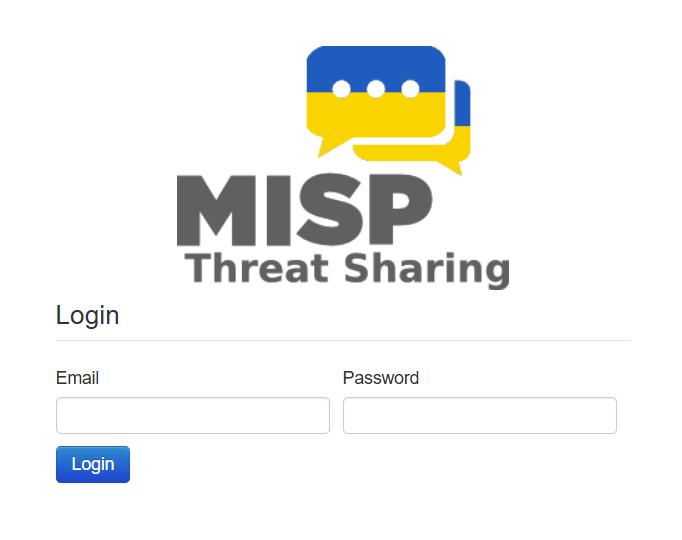
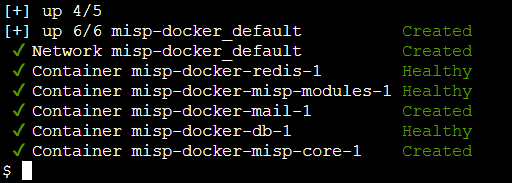
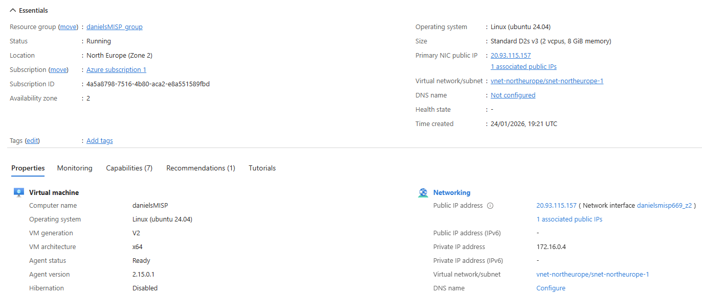
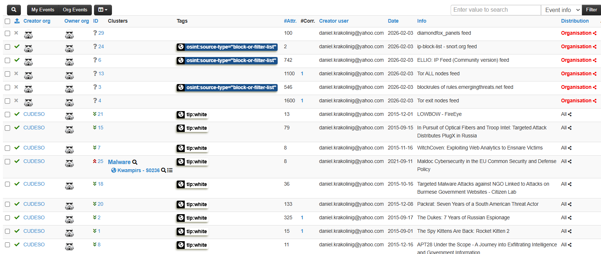
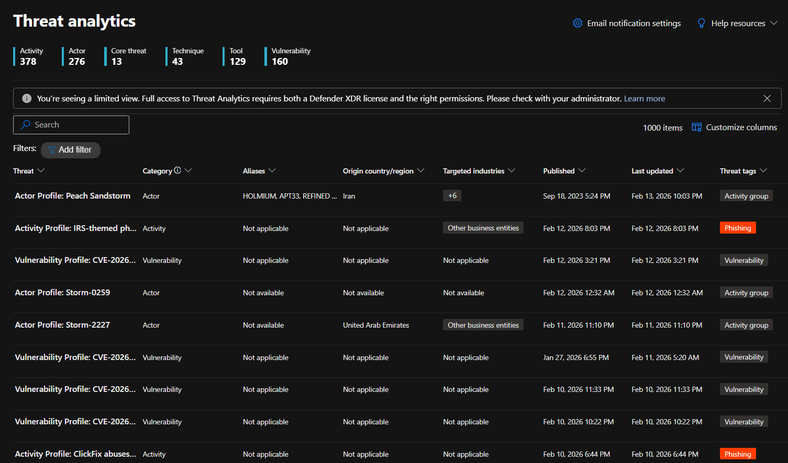

  

# Containerized Threat Intelligence & Honeypot Lab - MISP & Docker

## Overview
This project documents my experience deploying and exploring MISP (Malware Information Sharing Platform) using Docker, and experimenting with how threat intelligence data could be shared with a SIEM platform (Microsoft Sentinel).

The project was completed as a hands-on learning exercise to better understand:
- How threat intelligence platforms like MISP work
- How Docker can be used to deploy multi-container applications
- How APIs are used to access and filter threat intelligence data
- How open-source security tools can integrate with cloud services
- How cloud infrastructure can be secured

This repository represents a learning project, not a production-ready solution.

---

## Architecture (Setup)
- A Linux virtual machine running Docker
- MISP deployed using the official misp-docker project
- Several Docker containers that together make up the MISP platform
- An experimental integration with Microsoft Sentinel using an Azure Function
- Secure handling of credentials using Azure Key Vault

The focus was on understanding how these components fit together, rather than building everything from scratch.

---

## MISP Deployment with Docker

MISP was deployed using the official **misp-docker** project.
Docker was chosen to simplify deployment, dependency management, and upgrades.

### Deployment Steps:
- Deployed MISP using `docker-compose`
- Verified all containers reached a healthy state
- Configured MISP base URL and API access
- Enabling and reviewing threat intelligence feeds

---

## Virtual Machine & Networking
The MISP instance runs on an Azure Linux VM.
Network access was restricted using Network Security Groups (NSGs).

### Configuration Highlights:
- Explored MISP event, attribute, and tagging models
- Configured API queries with event filters (published status, timestamps, tags)
- Investigated how threat intelligence is normalized and exported
- Evaluated challenges of mapping open-source TI into SIEM-friendly formats

This setup allowed safe experimentation while limiting unnecessary exposure.

--- 

## MISP Events & Threat Intelligence Data

Once MISP was running, I focused on understanding the data itself:
- Viewing events from different feeds
- Understanding attributes, tags, and distribution levels
- Seeing how threat intelligence can vary in size and quality
- Learning how filters affect which data is returned by the API

This was one of the most useful parts of the project from a security learning perspective.

  
   

---

## Cloud Integration with Microsoft Sentinel

To explore how open-source threat intelligence can be consumed by a SIEM, a proof-of-concept integration with Microsoft Sentinel was implemented.

### Integration Approach
- Azure Function with Python
- PyMISP used for API communication
- API key stored securely in Azure Key Vault
- Events formatted into JSON
- Data sent to Log Analytics Workspace
- Logs available in Microsoft Sentinel

---

## Challenges Faced

### 1. Database Authentication Issues
- `.env` config file contained mismatched MariaDB passwords 
- Resulted in container restart loops
- Diagnosed using `docker logs`
- Resolved by rebuilding volumes

### 2️. API Authentication Errors (403)
- Invalid or outdated API key
- Required regenerating key and updating Azure Key Vault

### 3. Azure Function Vague Error Throwing
- Logger threw Error during execution
- Diagnosed using Azure's Advanced Debug Tools (Kudu)

### 4. Azure Function Timeouts
- Large data pulls caused function to exceed execution limits
- Highlighted importance of incremental sync and batching

---

## Project Status

✅ Azure VM deployed and securely configured  
✅ MISP fully operational in Docker  
✅ Threat feeds active and API integration validated  
✅ Azure Function successfully communicating with MISP  
🔄 Microsoft Sentinel integration actively being optimized

--- 

## Next Steps

- Implement incremental event synchronization
- Optimize data formatting for Sentinel ingestion
- Improve logging and monitoring visibility
- Extend the lab with a dedicated honeypot service

---

## Disclaimer

This project was developed as a learning exercise using official documentation and GitHub repositories for MISP, Docker, and Azure services. It is not a production deployment.

All sensitive information (API keys, credentials, IP addresses, and subscription details) has been redacted.

---

**Author**: [Daniel Krakolinig] 

**Version:** 1.0

**Last Updated:** February 2026
